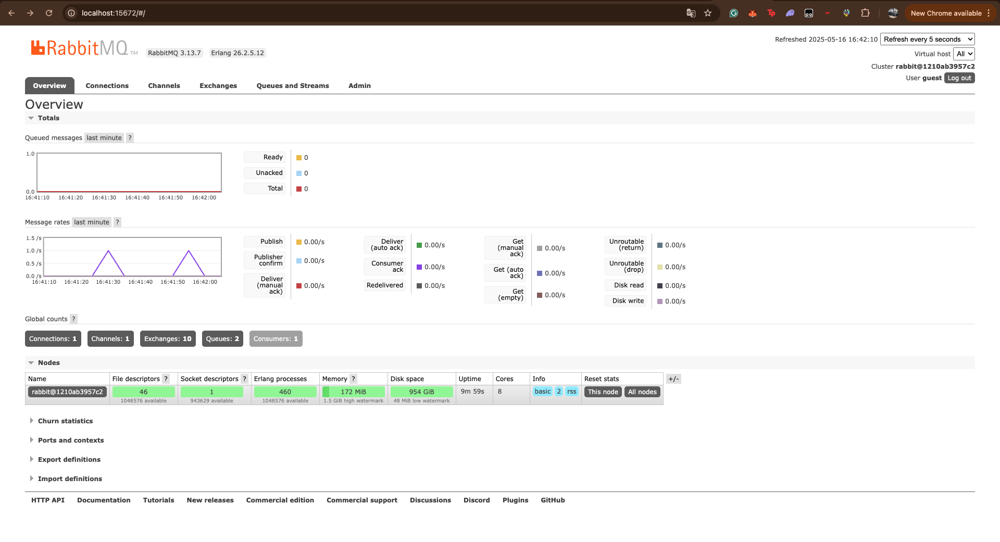

1.  a. Publisher saya akan mengirim 5 data kepada message broker dalam sekali jalan.

    b. URL yang sama berarti kode publisher dan subscriber memiliki konfigurasi untuk terkoneksi pada broker RabbitMQ yang sama.
Satu mesin, satu credentials, dan satu port.

Penjelasan : Yang terjadi adalah publisher mengirim data kepada message broker dan kemudian dapat dilihat bahwa subscriber
telah menerima pesan dari broker (RabbitMQ), dimana subscriber mengambil pesan dari queue yang disediakan oleh message broker.

Penjelasan : Setiap kali perintah cargo run dijalankan, publisher akan secara otomatis berinteraksi dengan RabbitMQ melalui AMPQ sehingga, tiap aktivitas yang terjadi, akan dicatat oleh RabbitMQ sebagai rate delivery atau consumption message yang diterima oleh subscriber.